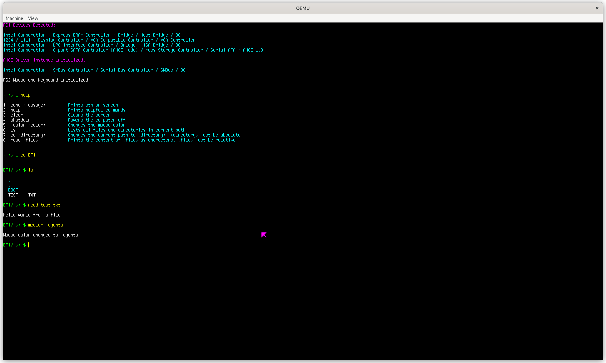

# BAS-kernel
A kernel with alot features like GOP and PCI support with uefi bootloader. It has AHCI (The mass storage ATA driver in intel). Also there is a FAT filesystem to read files. So that you can control the ports and drives on your computer. It can handle many interrupts like PS2 Mouse and keyboard. It's also very flexible and all functions are implented as understandable as they could. You can modify it in anyway you want.




## dependencies
```
  # Ubuntu, Debian:
  $ sudo apt install build-essential nasm mtools qemu-system-x86

  # Fedora:
  $ sudo dnf install gcc gcc-c++ make nasm mtools qemu-system-x86
```
## How to compile
This kernel is uploaded pre-compiled but if you made any changes to the kernel, you can compile it again with:
 ```
 $ cd BAS-kernel
 $ make
 ```
 And if you made changes to bootloader too:
 ```
 $ cd BAS-kernel
 $ cd gnu-efi
 $ make bootloader
 $ make
 $ cd ..
 $ make
 ```
 And keep in mind that if you made any significant changes to the headers in `src` or `desktop` directory, you should delete `lib` folder brefore compilation.
 
## How to run
Keep in mind that if you made any changes to the kernel, you should compile it before running. And also when it ran, wait for the timer to finish in 0.
```
cd BAS-kernel
make run
```

 ## How to modify
 Since some parts of kernel would be hard for beginners, I made another directory named `desktop` that has all important functions included from kernel. You can make changes to it and use any graphics with all supports implemented in kernel.
 
 ## Shell commands
 You can use see all supported commands with using `help` command.
 
 ## Kernel implementation progress
 - [x] Uefi support
 - [x] GOP for graphics support
 - [x] `.psf` file for font
 - [x] Page frame allocator
 - [x] Interrupts
 - [x] PS2 mouse and keyboard support
 - [x] PCI support
 - [x] AHCI (Drive initialization)
 - [x] AHCI (Port configrations)
 - [x] AHCI (Read from drives)
 - [x] Fat16 and Fat32 support
 - [ ] My own filesystem
 - [ ] Elf file support
 - [ ] Adding DE to make a complete OS
 - [ ] Some built-in applications
 - [ ] `.bas` file support to run my own apps on kernel
 - [ ] A collection of libraries to make `.bas` file with gcc and g++
